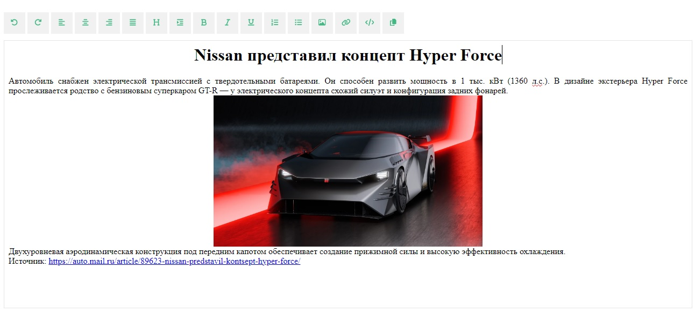

# WYSIWYG Editor

Приложение WYSIWYG (произносится [ˈwɪziwɪɡ], является аббревиатурой от англ. What You See Is What You Get, «что видишь, то и получишь») - простой редактор для формативания текста на Vue 3.



**Использованные технологии:**  
:small_orange_diamond: Vue 3  
:small_orange_diamond: Typescript

---

### Live demo: https://vue3-wysiwyg-editor.vercel.app/

Возможности приложения:

- вперед и назад по истории
- распределение текста по левому/правому краю или по ширине
- превратить выделенный текс в заголовок
- добавить новый абзац `<p>`
- формат текста жирный/курсив/подчеркнутый
- добавить список нумерованный/ненумерованный
- вставить изображение
- вставить ссылку
- показать исходный код
- копировать исходный HTML код в буфер обмена

## Project Setup

```sh
npm install
```

### Compile and Hot-Reload for Development

```sh
npm run dev
```

### Type-Check, Compile and Minify for Production

```sh
npm run build
```
